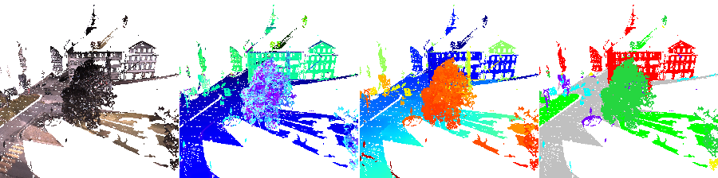

# SnapNet: point cloud semantization using deep segmentation network




## Paper

Please acknowledge the authors and the following research paper:

"Unstructured point cloud semantic labeling using deep segmentation networks", A.Boulch and B. Le Saux and N. Audebert, Eurographics Workshop on 3D Object Retrieval 2017

Abstract and paper [here](https://boulch.eu/publications/2018_cag_snapnet).

### Project

This work is part of two projects:
- [INACHUS](www.inachus.eu) is European FP7 project that aims to achieve a significant time reduction related to Urban Search and Rescue (USaR) phase by providing wide-area situation awareness solutions for improved detection and localisation of the trapped victims assisted by simulation tools for predicting structural failures and a holistic decision support mechanism incorporating operational procedures and resources of relevant actors.
- [DeLTA](delta-onera.github.io) is a research project hosted at ONERA, The French Aerospace Lab. Among its objectives are the development and the promotion of innovative machine learning based approaches for aerospace applications.

#### License

This code and weights are both released under a dual license, research and commercial.
Basically the code is GPLv3 for open access (contact us for non open purposes) and the weights are released under Creative Commons BY-NC-SA (contact us for non open purposes).
See the [license](LICENSE.md).

## Code

The code is composed of two main parts: a C++ library and a python scripts. The C++ library permits to load the files at Semantic 3D format and compute the composite features as described in the paper.

The python scripts generates the views using the Pyqtgraph 3D viewer and predict the segmentation using TensorFlow.

### Dependencies

##### C++
- Cython
- PCL, for installation see [pointclouds.org](pointclouds.org).
- OpenMP

Dependencies in the ```semantic3D_utils``` repository : 
- NanoFlann: nanoflann.hpp
- Eigen

#### Python
- TensorFlow: it is the deep learning framework used in this implementation **(deprecated)**
- Pytorch
- TQDM, Scipy, Numpy ...

### Building

To generate the C++/Python library.
```
    cd semantic3D_utils
    python setup.py install --home="."
```

It will build the library.

**Note**: in the ```setup.py```, we have filled the path with the standard path for PCL installation libraries and headers on Ubuntu 16.04.

### Configuration file

The Configuration file is a json file containing the parameters and paths:

    {
        "train_input_dir":"path_to_directory_TRAIN",
        "test_input_dir":"path_to_directory_TEST",
        "train_results_root_dir":"where_to_put_training_products",
        "test_results_root_dir":"where_to_put_test_products",
        "images_dir":"images",

        "training": true,

        "imsize":224,
        "voxel_size":0.1,
        "cam_number":10,
        "create_mesh" : true,
        "create_views" : true,
        "create_images" : true,

        "backend": "pytorch",

        "vgg_weight_init":"path_to_vgg_weights",
        "batch_size" : 24,
        "learning_rate" : 1e-4,
        "epoch_nbr" : 100,
        "label_nbr" : 10,
        "input_ch" : 3,

        "train_rgb" : true,
        "train_composite" : true,
        "train_fusion" : true,

        "saver_directory_rgb" : "path_to_rgb_model_directory",
        "saver_directory_composite" : "path_to_composite_model_directory",
        "saver_directory_fusion" : "path_to_fusion_model_directory",
        "output_directory":"path_to_output_product_directory"
    }

It is used in the python scripts, to avoid code recopy.


### Launching the python scripts

For the training and testing dataset, the point cloud decimation, views and images generation are called with:

    python3 sem3d_gen_images.py --config config.json

To train the models (rgb, composite and fusion) from scratch, run:

    python3 sem3d_train.py --config config.json

The semantic predictions on images and back-projection on the decimated clouds can be called using:

    python3 sem3d_test_backproj.py --config config.json

Finally to generate the files at the Semantic 3D format and assign a label to each point of the original point cloud, run;

    python3 sem3d_test_to_sem3D_labels.py --config config.json


## Tensorflow version

The new code has not been tested with tensorflow. Updates on the tensorflow code are welcome.
It is also possible to revert to a previous commit to get a working version.

### Pre-trained models

For the old Tensorflow version, the pre-trained weights are available:

  [RGB model](https://github.com/aboulch/snapnet/releases/download/v0.1.1/snapnet_model_rgb.zip)

  [Composite model](https://github.com/aboulch/snapnet/releases/download/v0.1.1/snapnet_model_composite.zip)

  [Fusion model](https://github.com/aboulch/snapnet/releases/download/v0.1.1/snapnet_model_fusion.zip) (to be used with RGB and Composite)


For training from scratch, if needed, the pretrained weights of VGG16, from the caffe model are available [here](https://drive.google.com/open?id=1kw-G7gH0II3wt2o30kivTNpgD9c_udm1)
